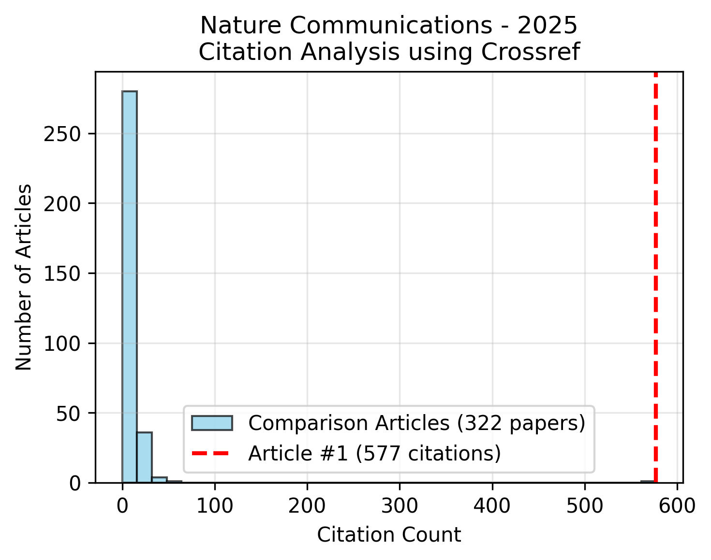

## Ethical Reporting

### Incorrect citations for Springer Nature articles

In 2025, while checking the proofs prior to publication of one of our recent works, I realized something was off in automatically generated references in my bibliography. With a bit of digging, I realized that the problem is systematic, and affect all online-only Springer Nature articles (those using article numbers), leading to an incredible number of incorrect references in the scientific literature. In particular Article Number 1s were accidentally getting references instead of other articles, most probably due to an error in the SpringerLink API. The issue has most probably been around since 2011 and affects millions of authors.

<figure style="display:table;">
  
  <figcaption style="display:table-cell; vertical-align:bottom; padding-left:4px;">Example of citation count histogram of Nature Communications Vol. 16 (volume of year 2025). Comparison articles were published on same day as Article #1</figcaption>
</figure>

See more on [SciRate](https://scirate.com/arxiv/2511.01675) or [arXiv](https://arxiv.org/abs/2511.01675).

### Security vulnerability

In 2024, I discovered and reported a critical security vulnerability in the cryptocurrency exchange Kraken, which put the funds of users at risk.

 

## Committee, Jury memberships


- {{ committee.name }} - {{ committee.role }} ({{ committee.year }}), {{ committee.organization }}


 

## Peer review

In general, I aim at reviewing at least as many articles as I published. In the spirit of transparency (and due to the lack of a commonly used peer review tracking system), I am tracking my peer reviews here.


- {{ journal.journal }}: {{ review.year }} (×{{ review.count }}), 

